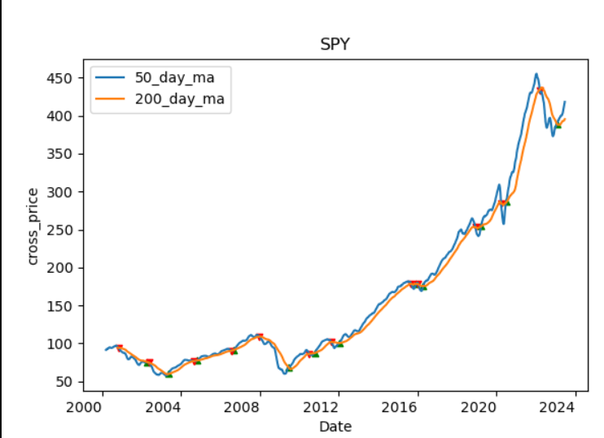

# Stock Price 50day - 200day moving average signal API

Return a plot of all the times the 50 day moving average crosses the 200 day moving average of the Adj. Close price.

## Start the API
```
uvicorn main:app --reload
```

## Example:
URL example: 127.0.0.1:8000/stocks/{ticker_symbol}?start_date={yyyy-mm-dd}&end_date={yyyy-mm-dd}

http://127.0.0.1:8000/stocks/SPY?start_date=2000-01-01&end_date=2023-06-26
returns this

